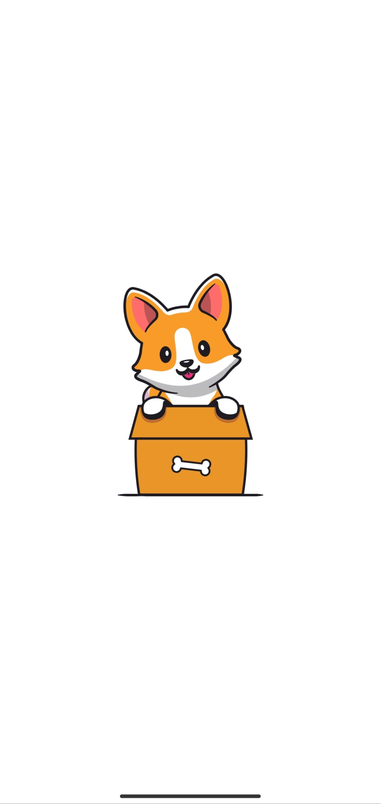
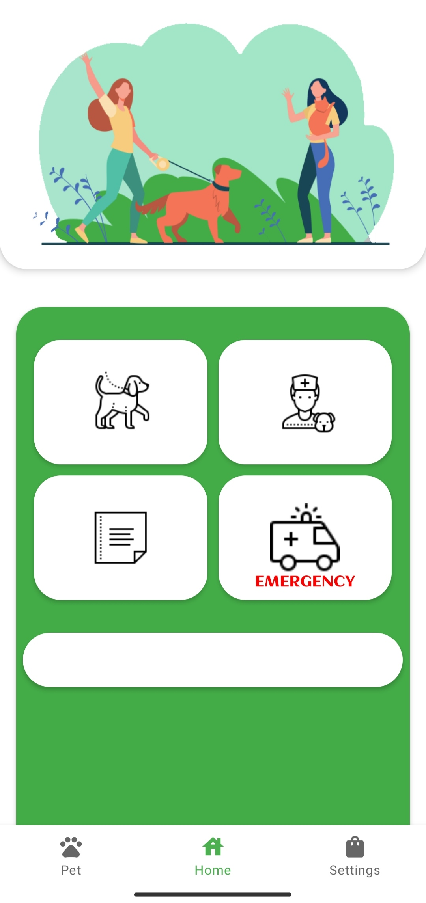
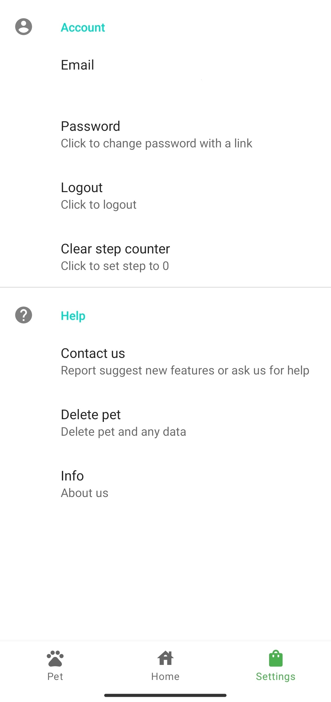

# MyPet
MyPet is an Android application, developed in Kotlin, designed to help pet owners record essential information about their pets. This app allows users to monitor medical visits, keep track of vaccinations and medications, and even includes a built-in pedometer.

## Features
Pet Registration: Easily register your pets by providing details such as name, breed, and age.

Medical Records: Keep track of your pet's medical history, including past visits, vaccinations, and medications.

Pedometer: Monitor your pet's activity levels with the integrated pedometer feature.

## Usage
1. Open MyPet on your Android device.

2. Register your pet by providing the necessary information.

3. Explore the medical records section to monitor visits, vaccinations, and medications.

4. Use the built-in pedometer to track your pet's daily activity.

<figure>
  
</figure>

-------------------------------------------------------------------------------------

### Home:
<figure>
  
</figure>

-------------------------------------------------------------------------------------

### Settings:
<figure>
  
</figure>
